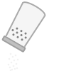

<div align="center">

</div>

## Overview
Saltup provides comprehensive tools for:
- Neural network model management
- Object detection dataset generation and loading
- Bounding box calculations and visualizations
- Model inference optimization

The framework offers robust features for:
- Model configuration and deployment
- Data preprocessing and augmentation
- Performance metrics tracking
- Easy integration with popular AI libraries

## Key Features

- **Model Management**
  - Load, save, and manage neural network models efficiently
  - Cross-framework compatibility (TensorFlow/Keras and PyTorch)

- **Data Handling**
  - Generate synthetic data for object detection tasks
  - Load and preprocess real-world datasets (COCO, Pascal VOC, YOLO)
  - Apply various image transformations and augmentations

- **Visualization**
  - Bounding box annotations visualization
  - Model outputs analysis
  - Data pipeline debugging

- **Configuration Management**
  - Logging configuration with TQDM support
  - Easy integration of custom configurations

## Example Use Case
Saltup can be used in various AI pipelines like:
1. **Model Training Pipeline**
   ```bash
   # Load a neural network model
   model = NeuralNetworkManager.load_model("path/to/model.pth")
   
   # Loading training data
   datagen = AnchorsBasedDatagen(...)
   train_dataset = datagen.generate_batch(1024)
   
   # Train the model with optimized parameters
   trainer = ModelTrainer(model, train_dataset, num_epochs=10)
   ```

2. **Inference Pipeline**
   ```bash
   # Load inference-ready model
   model = NeuralNetworkManager.load_model("path/to/model.pth", inference=True)
   
   # Create an image and get predictions
   image = load_image("input.jpg")
   boxes, scores = model_inference(model, image)
   
   # Process results
   filtered_boxes = filter_by_confidence(boxes, scores, 0.5)
   visualize_boxes(image, filtered_boxes)
   ```

## Documentation
- [saltup/docs](https://github.com/freedreamer82/saltup/tree/main/docs) - Detailed documentation for all features and usage examples
- [saltup/examples](https://github.com/saltup/examples) - Sample projects demonstrating Saltup's capabilities

If you have any specific questions or need help with a particular feature, feel free to ask!
