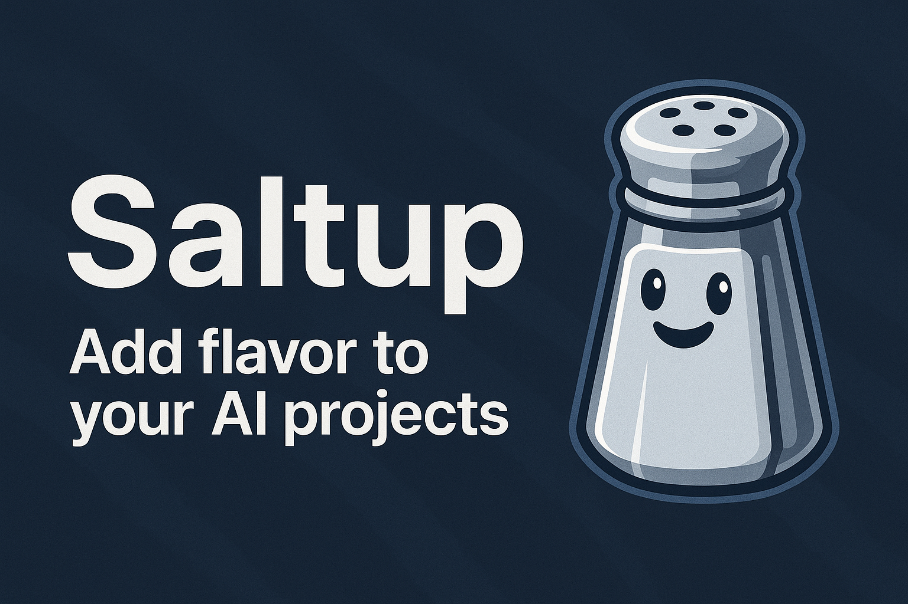

<div align="center">

</div>

# Saltup 🧂

The universal AI toolkit that works with your existing models and data, regardless of format.

Stop wrestling with format conversions. Stop rewriting data loaders. Save your time and Start building.

## Create a Python Environment (e.g: std python env, conda, ...)

```bash
python3 -m venv saltup-env
```

## Activate the Python Environment
```bash
# On Linux/macOS
source saltup-env/bin/activate  

# On Windows:
saltup-env\Scripts\activate
```

## Repository Installation in the Active Python Environment

Install directly from GitHub:
```bash
pip install git+https://github.com/freedreamer82/saltup.git
```

For development:
```bash
git clone https://github.com/freedreamer82/saltup.git
cd saltup && ./makePackage.sh -d
```

## The Magic

Load any model format through one interface:
```python
from saltup.ai.nn_model import NeuralNetworkModel

model = NeuralNetworkModel("model.pt")       # PyTorch
model = NeuralNetworkModel("model.keras")    # TensorFlow/Keras  
model = NeuralNetworkModel("model.onnx")     # ONNX
model = NeuralNetworkModel("model.tflite")   # TensorFlow Lite

# Same interface, any format
predictions = model.model_inference(your_data)
```

Work with any dataset format:
```python
from saltup.ai.object_detection.dataset.loader_factory import DataLoaderFactory

# Auto-detects COCO, Pascal VOC, YOLO formats
train_dl, val_dl, test_dl = DataLoaderFactory.get_dataloaders("./your_dataset")
```

Saltup automatically handles preprocessing and postprocessing for **all major YOLO variants**. No more manual image resizing, normalization, or output decoding:
```python
from saltup.ai.object_detection.yolo.yolo_factory import YoloFactory
from saltup.ai.object_detection.yolo.yolo_type import YoloType

# Zero-configuration YOLO inference - preprocessing & postprocessing included
yolo_ultralytics = YoloFactory.create(YoloType.ULTRALYTICS, "yolov8.pt", num_classes=80)
yolo_damo = YoloFactory.create(YoloType.DAMO, "damo_yolo.onnx", num_classes=80)
yolo_nas = YoloFactory.create(YoloType.SUPERGRAD, "yolo_nas.pt", num_classes=80)
yolo_anchors = YoloFactory.create(YoloType.ANCHORS_BASED, "yolov3.weights", 
                                  num_classes=80, anchors="anchors.txt")

# Same simple interface, optimized processing for each architecture
result = ultralytics_yolo.run(image)  # Automatic letterboxing + CHW normalization
result = damo_yolo.run(image)         # DAMO-specific preprocessing + output parsing
result = nas_yolo.run(image)          # NAS-optimized transforms + confidence handling
result = anchors_yolo.run(image)      # Anchor box decoding + grid cell processing
```

Train across frameworks with production-ready callbacks:
```python
from saltup.ai.training.train import training
from saltup.ai.training.app_callbacks import MLflowCallback, FileLogger, YoloEvaluationsCallback, MQTTCallback

# Production callbacks for real workflows
callbacks = [
    MLflowCallback(mlflow_client, run_id),        # Experiment tracking
    FileLogger("training.log", "best_model.csv"), # File logging
    YoloEvaluationsCallback(yolo_type, val_data), # Model evaluation
    MQTTCallback("broker", 1883, "training/metrics") # Remote monitoring
]

# Mix TensorFlow data with PyTorch models + powerful callback system
training(model, train_dataloader, validation_dataloader, callbacks=callbacks)
```

Create custom callbacks for your specific needs:
```python
from saltup.ai.training.callbacks import BaseCallback, CallbackContext

class CustomCallback(BaseCallback):
    def on_epoch_end(self, epoch, context: CallbackContext):
        # Your custom logic: send notifications, update dashboards, etc.
        if context.val_loss < self.best_threshold:
            self.send_slack_notification(f"New best model! Loss: {context.val_loss}")
    
    def on_train_end(self, context: CallbackContext):
        # Cleanup, final reports, model deployment, etc.
        self.deploy_model(context.best_model)
```

## Track the progess of the training phase with built-in callbacks
```python
callbacks = [MLflowCallback(...), MQTTCallback()]
```

## Core Capabilities

**🔄 Format Freedom**  
One interface for .pt, .keras, .onnx, .tflite models. Load once, use everywhere.

**📊 Dataset Flexibility**  
Auto-detect and work with COCO, Pascal VOC, YOLO formats without manual conversion.

**🎯 YOLO Pre/Post-Processing Out-of-the-Box**  
Built-in preprocessing and postprocessing for all major YOLO variants:
- **Ultralytics** (YOLOv5, YOLOv8, YOLOv11): Automatic letterboxing, RGB normalization, CHW format
- **DAMO-YOLO**: Optimized preprocessing for DAMO architecture, proper output decoding
- **YOLO-NAS/SuperGradients**: NAS-specific image transforms and confidence handling  
- **Anchors-Based** (YOLOv3, YOLOv4): Anchor box management, proper grid cell decoding
- **Custom preprocessing** supported for any variant

**🔀 Cross-Framework**  
Mix TensorFlow and PyTorch components in the same pipeline. Best of both worlds.

**🚀 Production Ready**  
Built-in quantization, model conversion, and deployment tools for real-world use.

## Ready-to-Use Tools

Get productive immediately with battle-tested command-line utilities:

```bash
# Model operations
saltup_keras2onnx model.keras              # Convert between formats
saltup_onnx_quantization model.onnx        # Optimize for deployment

# Quick inference with automatic pre/post-processing
saltup_yolo_image_inference --model yolov8.pt --type ultralytics --img image.jpg --num_class 80
saltup_yolo_video_inference --model model.onnx --type damo --img image.jpg --num_class 80
saltup_yolo_s3_inference --model model.tflite --type supergrad --img /path/to/images --num_class 80

# For anchor-based models
saltup_yolo_image_inference --model yolov4.keras --type anchors_based --img image.jpg --num_class 80 --anchors anchors.txt

# Dataset utilities
saltup_yolo_count_classes ./dataset        # Analyze your data
saltup_info                                # Package information
```

## Real-World Workflows

**Model Format Pipeline:**
Train in PyTorch → Convert to ONNX → Quantize → Deploy to embedded device

**Cross-Framework Training:**
Load COCO dataset → Train with TensorFlow → Export as PyTorch → Optimize with ONNX

**Dataset Format Freedom:**
Pascal VOC annotations → Auto-load as YOLO → Train any model → Deploy anywhere

## Why Saltup?

Because your time is valuable. Because formats shouldn't dictate your architecture. Because production deployment should be simple, not a research project.

Work with what you have. Build what you need. Deploy where you want.
